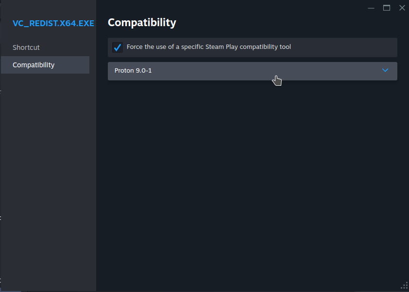

# Guide

This is a more thorough walkthrough of how to set this up.

1)  Go to desktop mode on your steam deck and download the latest version of Duckstation (Windows version) and the VC++ runtime (both available from [here](https://duckstation.org/windl))

2)  Open the steam client, go to games and select "add a none-steam game to my library..." 

   

3)  On this screen you can select an app to add. It won't appear here, so we'll need to click browse to manually select it. 
 

4)  Select your VC++ runtime, it should look something like this: 

5)  You will need find it on the steam library as a game. Right click select it, choose properties then go to the
compatibility tab and choose to force use of a compatibility tool, then select a version of proton. In my example I am using
the latest version at time of writing.

6)  Once we have done this, press start and run the installer. It will install this dependency in a new prefix on your steam deck
which will now use to place the remaining files. Go to the OnlineCTR discord and get the latest patch and version of the client.
Follow the instructions on the discord if you need more help with patching the game. Also get the Windows version of Duckstation
if you haven't already.

7)  Once you've done this, we will need to find the prefix location. Go to `/home/deck/.local/share/Steam/steamapps/compatdata`
in Dolphin and you should see something like this. We need to figure out which one contains our VC++ runtime installation, the 
fortunately there is a very easy way to do this. What we can do is order them by date created. Right click to open a menu and
select sort by created. Your last directory should be the one you're looking for, but to be sure right click select it and click
properties to see the date and time it was made.

8)  Now we have the correct directory, go into it and find your user space. The full path should look something like this:
`/home/deck/.local/share/Steam/steamapps/compatdata/<prefix>/pfx/drive_c/users/steamuser`
Place Duckstation, the patched game and the client in here as you see fit. For example, I created two seperate directories for them.

9)  Now go back to steam, find the VC++ runtime that you added and right click to get the properties up once more. Now we will
change the Target and Start in properties in the shortcut tab to Duckstation inside your prefix. I've renamed it to Duckstation for
the screenshot.

Your target should have something like this in it below:
`/home/deck/.local/share/Steam/steamapps/compatdata/<prefix>/pfx/drive_c/users/steamuser/duckstation/duckstation-windows-x64-release`

For start in, use the same filepath but add the name of the executable on the end. The default should be something like `duckstation-qt-x64-ReleaseLTCG.exe`.
Don't forget the forward slash.

10)  Next we setup Duckstation. Run it and follow the instructions, you will need to add your bios to a filepath that should look something like this:
`/home/deck/.local/share/Steam/steamapps/compatdata/<prefix>/pfx/drive_c/users/steamuser/Documents/DuckStation/bios`

Please note that on the bios screen, you need to select auto-detect for NTSC-UC and if it is correctly detecting your bios, it should list them. If this
is not the case, make sure your bios are in the correct location and then cancel and restart the Duckstation setup process.

Additionally you will need to set a location to find onlinectr from within the prefix. For example I use the following path:
`/home/deck/.local/share/Steam/steamapps/compatdata/<prefix>/pfx/drive_c/users/steamuser/onlinectr`

Create a folder to place your game and place your patched version of the game here. Make sure you select it in the Duckstation setup.
It should look something like this:

To keep things simple, I would suggest placing the client in this folder as well - the instructions will assume you are doing this. Place
your game in here alongside the client so Duckstation will detect it.

Next, configure the player 1 controller by selecting SDL-0 as shown below:

Now Duckstations setup should be done and it will open. Go to settings and set things up as shown in the screenshots.

Interface:

Console:

Graphics:

Note: Make sure you set the renderer and adapter otherwise you will get errors when you try to play the game!

11)  Now we are finished setting up Duckstation, next we need to get Steam Tinker Launch. To do this we'll install it using ProtonUp-QT. 
Close Duckstation for now, open the discover store and install it. 

12)  Once it's installed run it, you'll see a screen similar to this. You need to select "add version". 

13)  Select "SteamTinkerLaunch" in the compatibility dropdown and install.

14)  Now for the game we will change the compatibility tool to Steam Tinker Launch as shown below. Note: In this screenshot
I've renamed Duckstation in my library to Online CTR.

15)  Run the game. You will be presented with the Steam Tinker Launch screen. It will only appear for 2 seconds (by default, is configurable).
Select main menu in the bottom right corner then select the game menu option.

For the next bit a mouse would be recommended. If you don't have one you can easily use, you can use the left trackpad to scroll, which will make
navigating much easier. You can scroll down with a clockwise movement and up with anti-clockwise. It might not be super clear, but in the next
section you will need to scroll through options and find those listed in the next step.

16)  Select the following options:
       - select "use custom command" - then in custom command, add client.exe
       - select "fork custom command"
       - select "force Proton with custom command"
       - (optional) in "Game command arguments" add arguments for launching duckstation. Would recommend at least using
       "-bigpicture" or "-boot </path/to/onlinectr>"

Some screenshots of how this will look:

Game Menu:

Part 1

Part 2

Part 3

17)  Now you should be good to go! Select save and play to save these settings and run it again and you should find both Duckstation and 
the client open. If you have got this far it's time to test it in gaming mode.

18) Go to gaming mode and try to play it. Using the steam button, you will have a menu that will allow you to
switch between the client and Duckstation - note that you may need to enable developer mode first, which you can find in
the steam settings in gaming mode. Use this to select the client and type your username in (steam button + X to bring up virtual keyboard) 
and switch back. If everything was done correctly, you should connect and get online!