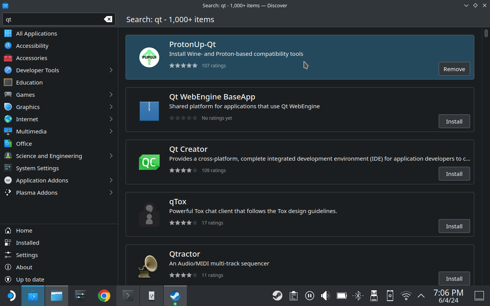
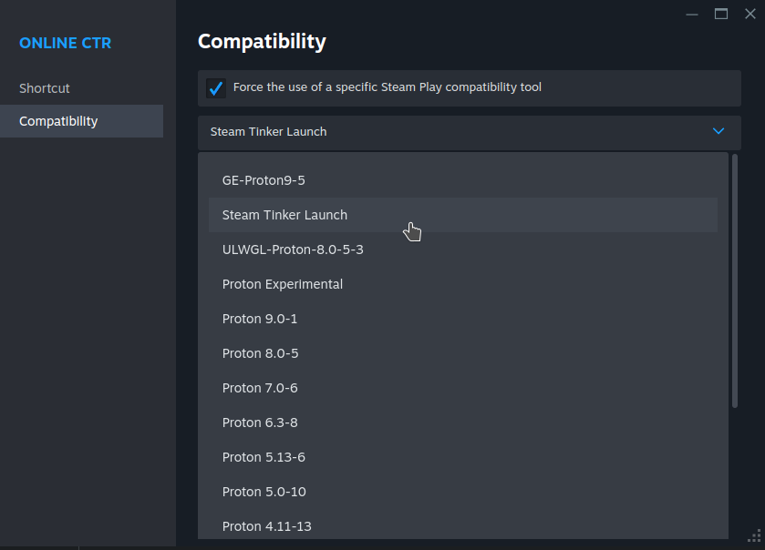

# Guide

This is a more thorough walkthrough of how to set this up.

1)  Go to desktop mode on your steam deck and download the latest version of Duckstation (Windows version) and the VC++ runtime (both available from [here](https://duckstation.org/windl))

2)  Open the steam client, go to games and select "add a none-steam game to my library..." 

   

3)  On this screen you can select an app to add. It won't appear here, so we'll need to click browse to manually select it. 
 

4)  Select your VC++ runtime, it should look something like this: 

5)  You will need find it on the steam library as a game. Right click select it, choose properties then go to the
compatibility tab and choose to force use of a compatibility tool, then select a version of proton. In my example I am using
the latest version at time of writing.

6)  Once we have done this, press start and run the installer. It will install this dependency in a new prefix on your steam deck
which will now use to place the remaining files. Go to the OnlineCTR discord and get the latest patch and version of the client.
Follow the instructions on the discord if you need more help with patching the game. Also get the Windows version of Duckstation
if you haven't already.

7)  Once you've done this, we will need to find the prefix location. Go to `/home/deck/.local/share/Steam/steamapps/compatdata`
in Dolphin and you should see something like this. We need to figure out which one contains our VC++ runtime installation, the 
fortunately there is a very easy way to do this. What we can do is order them by date created. Right click to open a menu and
select sort by created. Your last directory should be the one you're looking for, but to be sure right click select it and click
properties to see the date and time it was made.

8)  Now we have the correct directory, go into it and find your user space. The full path should look something like this:
`/home/deck/.local/share/Steam/steamapps/compatdata/<prefix>/pfx/drive_c/users/steamuser`
Place Duckstation, the patched game and the client in here as you see fit. For example, I created two seperate directories for them.

9)  At this point you'll either want to change the target path for the VC++ runtime in your steam deck library or simply add
the Duckstation executable as a none steam game. You can follow the previous instructions if you decide to do the latter to set it up
correctly.

10)  At this point you may want to play Duckstation, which will take you through the first time setup process. Follow the instructions,
making sure to add your bios inside the prefix for Duckstation to find as well. Once setup, go into the settings and modify the settings
as per the instructions in the Online CTR discord. Additionally, make sure the graphics adapter has the deck's APU selected.

11)  Next we need to get Steam Tinker Launch. To do this we'll install it using ProtonUp-QT. Open the discover store and install it. 

12)  Once it's installed run it, you'll see a screen similar to this. You need to select "add version". 

13)  Select "SteamTinkerLaunch" in the compatibility dropdown and install.

14)  Now for the game we will change the compatibility tool to Steam Tinker Launch as shown below. Note: In this screenshot
I've renamed Duckstation in my library to Online CTR.

15)  Run the game. You will be presented with the Steam Tinker Launch screen. It will only appear for 2 seconds (by default, is configurable).
Select main menu in the bottom right corner then select the game menu option.

16)  Select the following options:
       - select "use custom command" - then in custom command, add client.exe
       - select "fork custom command"
       - select "force Proton with custom command"
       - (optional) in "Game command arguments" add arguments for launching duckstation. Would recommend at least using
       "-bigpicture" or "-boot </path/to/onlinectr>"

17)  Select save and now you should be good to go! Try running it again and you should find both Duckstation and the client open. If
you have got this far it's time to test it in gaming mode.

19) Go to gaming mode and try to play it. You should have both windows open. Using the steam button, open a menu to allow you to
switch between the client and Duckstation. Use this to select the client and type your username in and switch back. If everything
was done correctly, you should connect and get online! If you can't switch windows, check if developer mode is enabled in steam settings.